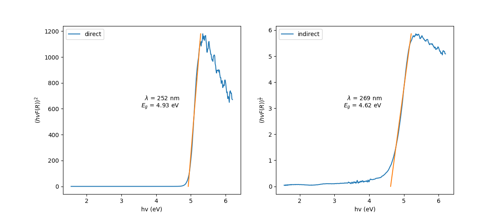
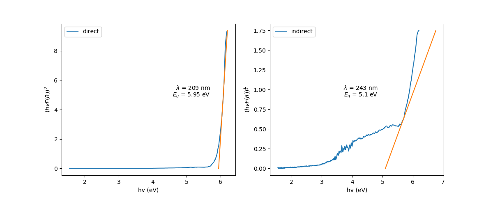
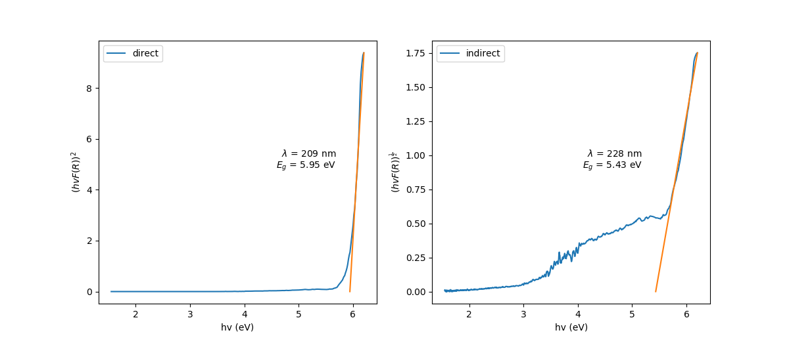

[TOC]


# uvvis模块
处理紫外可见分光光度法的实验数据

## 使用说明

## API 参考

### class UvvisData
### class ConcentrationChangeData
### read_asc(file)
### read_ascdir(filedir)
### read_ccdatas(cc_filedir, wavelength)
### get_concentration_change(uvvis_datas, wavelength, name)
### draw_uvvis(uvvis_datas)
### draw_concentration_change(cc_datas)


# uvvisdrs模块
处理处理紫外可见漫反射光谱的实验数据

## 使用说明

### 自动拟合

以样品1为例，原始数据保存在1.txt中，内容应如下，否则程序无法正确识别：
```
1.txt
"Storage 193957 - RawData - F:\201701009\2017-2896\1.spc"
"波长(nm)","T%"
200.00,9.750
200.50,9.706
201.00,9.419
...
```
绘制紫外可见漫反射光谱数据分析图，代码如下所示
```python
import matplotlib.pyplot as plt
import uvvisdrs

drs = uvvisdrs.read_raw(r'F:\Laboratory\实验数据\紫外漫反射\1.txt')
#该行将读取原始文件中的数据，并保存至drs对象中，drs为UvvisDrsData的一个实例
#创建对象的同时已经自动完成了对数据的拟合和计算，后面的代码仅用于输出结果
#单引号内为数据文件的完整路径，上面的代码中是示范，使用时请替换成你的文件路径
#注意！路径应包裹在r''内，不要省略r
fig = uvvisdrs.draw_hvfr(drs)
#绘制drs的图像
plt.show()
#调用此函数会显示并删除fig对象
#先显示图像以判断结果是否符合要求
#如果符合则保存图像和数据
fig = uvvisdrs.draw_hvfr(drs)
#由于plt.show()删除了之前的图像缓存，再次绘制drs的图像
fig.savefig(str(drs.name)+'_result.png')
#保存图像到python解释器的当前目录
uvvisdrs.write_drs(drs)
#将实验数据写入txt文件中，并保存到python解释器的当前目录
```
以上代码应该得到类似这样的结果：

```
1_result.txt
samlpe:1
direct band gap: wevelength=251.729549238nm energy=4.92592150487eV
	linear fit coefficient: slope=3302.67616762 intercept=-16268.7235577 r=0.990583817164
indirect band gap: wevelength=268.535431803nm energy=4.61764018131eV
	linear fit coefficient: slope=9.88591908185 intercept=-45.6496171816 r=0.994073460789
datas:
wavelength	R	hv	F(R)	(hvF(R))^2	(hvF(R))^1/2
200.0	0.0975	6.2	4.17695512821	670.660917258	5.08892147659
200.5	0.09706	6.18453865337	4.19998270966	674.698308624	5.09656309795
201.0	0.09419	6.16915422886	4.35551415278	721.988223942	5.18361250041
```
### 手动拟合

但数据不总是尽如人意的，如果程序自动拟合的结果不好，则需要调用refit()函数来手动拟合
下面是手动拟合的例子：
```python
import matplotlib.pyplot as plt
import uvvisdrs

drs = uvvisdrs.read_raw(r'F:\Laboratory\实验数据\紫外漫反射\3.txt')
fig = uvvisdrs.draw_hvfr(drs)
plt.show()
```
发现自动拟合的结果有误，第二张图中由于曲线有突起，使得程序算法中默认的拟合算法出现偏差，如下：

接下来需要手动拟合，需要先从图上找出较比较直的一段曲线
将鼠标移动到这段曲线中央的一点上，读出其横坐标，输入至refit()函数中即可完成一次手动拟合
```python
uvvisdrs.refit(drs, 0.5, 5.9)
#第一个参数是要重新拟合的数据，第二个参数为曲线类型的代号
#direct曲线代号为2，indirect曲线代号为0.5，其他值无用
#第三个参数为拟合的起始点的横坐标，拟合过程将会从该点开始，取左右各a个数据点一起拟合直线
#拟合时默认从a=25开始，如果相关系数r<0.99，则缩小取值范围，知道r>0.99为止
#还有第四个可选参数a，这里没给，如果想扩大或缩小拟合范围，可输入该参数，如a=10
```
手动拟合结果如下：

```
3_result.txt
samlpe:3
direct band gap: wevelength=208.567595333nm energy=5.94531474567eV
	linear fit coefficient: slope=36.2160677085 intercept=-215.315921377 r=0.995940025983
indirect band gap: wevelength=228.215339168nm energy=5.43346474659eV
	linear fit coefficient: slope=2.2760882223 intercept=-12.367045116 r=0.992611013538
datas:
wavelength	R	hv	F(R)	(hvF(R))^2	(hvF(R))^1/2
200.0	0.38403	6.2	0.49399661602	9.3806153212	1.75007971799
200.5	0.38454	6.18453865337	0.492524849951	9.27835342055	1.74529051228
201.0	0.38687	6.16915422886	0.485858811616	8.98403474041	1.73128216716
```

## API 参考

### class UvvisDrsData
### refit(drs, n, fp, a)
### logistic_fit(x, y)
### num_differ(x, y)
### read_raw(file)
### write_drs(drs)
### draw_hvfr(drs)